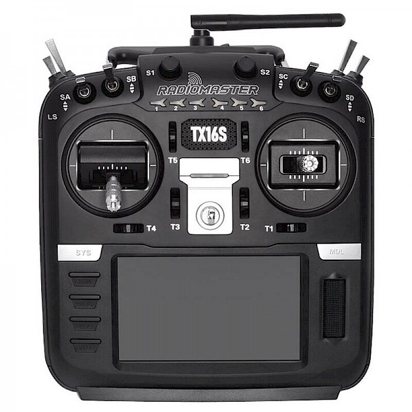
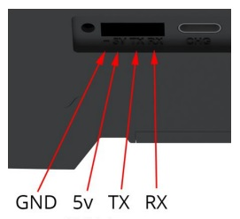
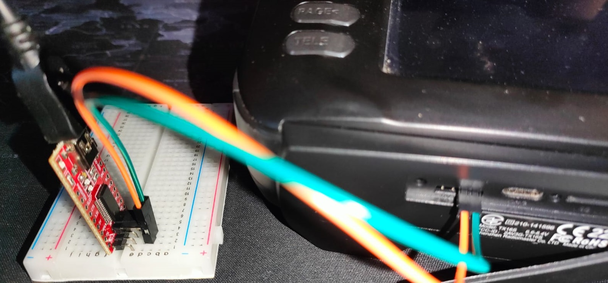
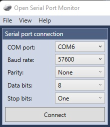
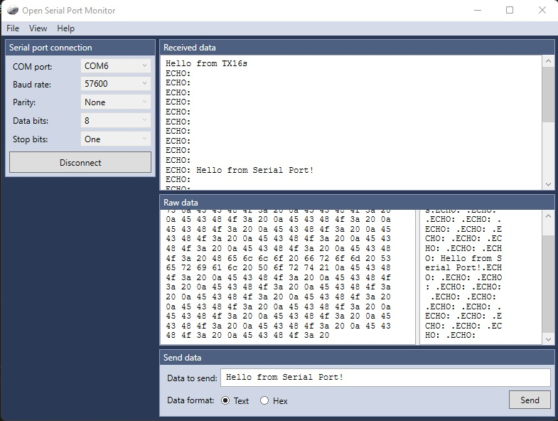

# Bidirectional data to Radiomaster TX16s UART port

La mayoría de las guías que hay sobre instalar módulos bluetooth o usar el puerto UART solo muestran como mandar telemetría hacia fuera, después de buscar por todo internet no he encontrado ninguna que explique como poder darle instrucciones desde UART o con algún módulo externo. En esta guía se explica como realizarlo y algunos métodos para poder depurar el código.

He escogido realizar el proyecto sobre la TX16s, ya que esta soporta más de 40 protocolos y me permitirá operar cualquier aparato RC de manera programática, aunque también debería funcionar en cualquier otra emisora que soporte EdgeTX o OpenTX y UART (Jumpter, Taranis, Eachine, SPektrum...)

El proyecto todavía está en fase de desarrollo, pero la versión mínima de enviar/recibir funciona.

## Requisitos
* **EdgeTX 2.6.0 or above** (todavía no ha sido probado en versiones inferiores o debería funcionar en OpenTX, pero no se ha probado)
* Pines **TX y RX** en la emisora, pueden ser internos o externos
* Módulo **Bluetooth HC-05** o cualquier módulo **FTDI UART to USB** en mi caso tengo FT232RL (Cualquier otro sistema que le permita una comunicación UART bidireccional es valido)
* Programa lectura/escritura serial data [OpenSerialPortMonitor](http://github.com/whitestone-no/open-serial-port-monitor/releases)  (También puede usar cualquier otro que prefiera)

---
 

## 1. Conectar FTDI con emisora
Conectar el pin **TX al RX** y el pin **RX al pin TX**
Los pines VCC y GND se utilizarán más adelante.
Es recomendable conectarlo en una placa de desarrollo, ya que más adelante facilitará depurar el código.

   

 

### 1.1 Verificar envió/recibo de datos

1. Deberá instalar el siguiente Lua script ([bid.lua](./lua_scripts/tests/bid.lua)) en la carpeta FUNCTIONS de su emisora, debe activarlo de la manera que prefiera.

2. Abra OpenSerialPortMonitor y configurelo como se muestra en la imagen (El puerto COM depende de la ranura USB donde esté) y conéctese.

3. Reinicie la emisora. Al encenderse debería ver algo como esto, puede enviar datos a la Emisora y este le debería responder con el formato "ECHO: {valor_recibido}". Mientras no envíe datos, se mostrará con el formato "ECHO: "

    Este paso es importante, ya que permite asegurarnos que no hay problemas con el envío/recibo de datos.
    Si en su consola se muestran símbolos extraños, espacios sin sentidos, huecos en blanco u otro tipo de anomalías, debe probar otro cable y asegurarse de conectar el cable lo más cerca posible entre emisora/ftdi además de alejar cualquier fuente electromagnética. Si no se soluciona, pruebe con diferentes niveles de baud rate.

TODO: ....
    

## Enlaces de interés:
- [Lua API C++ code](https://github.com/EdgeTX/edgetx/blob/main/radio/src/lua/api_general.cpp)
- [EdgeTX Lua Reference Guide](https://luadoc.edgetx.org/)
- [OpenTX Lua Fields](http://downloads-20.open-tx.org/firmware/lua_fields.txt) (Also works for EdgeTX)